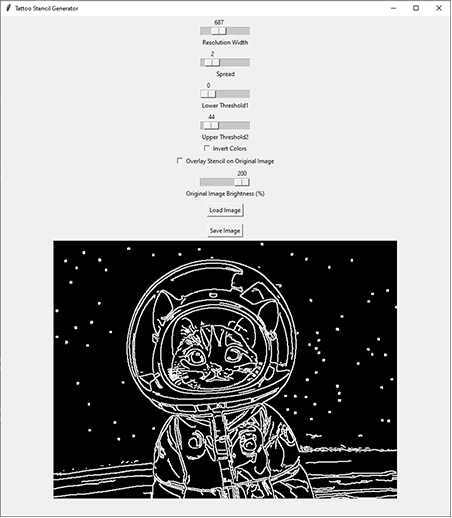

# Stencilizer 

A simple Python Image-to-tattoo stencil generator.

**Python 3.7+** is recommended.

Dependiencies:

| Package           | Install Command             | Notes                                                                                                                  |
| ----------------- | --------------------------- | ---------------------------------------------------------------------------------------------------------------------- |
| **opencv-python** | `pip install opencv-python` | For image loading, processing, edge detection                                                                          |
| **numpy**         | `pip install numpy`         | For kernel creation and pixel operations                                                                               |
| **Pillow**        | `pip install Pillow`        | For converting OpenCV images to Tkinter-compatible format                                                              |
| **tkinter**       | *(built-in)*                | GUI framework (included with standard Python on Windows/macOS). For Linux, install with: `sudo apt install python3-tk` |

.
